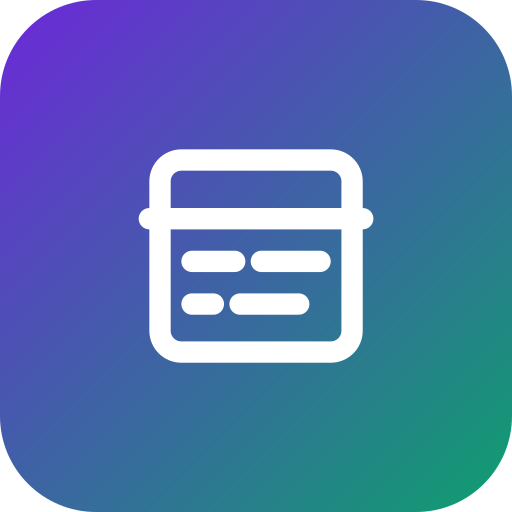

    <h1 >BillSplit</h1>
    

        A modern bill splitting app. Powered by Together.ai.
    

## Tech Stack

- Next.js 15 with App Router for modern web development
- Together.ai for advanced LLM capabilities
- Helicone for LLM observability and monitoring
- Amazon S3 for secure image storage
- Vercel for seamless deployment and hosting

## How it works

1. User uploads a picture of the bill
2. The app processes the image directly using Google's Gemini Vision API with JSON mode
3. The app let the user choose how to split items and add people names
4. The app displays the final summary with the split of the bill

## Cloning & running

1. Fork or clone the repo
2. Create an account at https://aistudio.google.com/app to get a Gemini API key
3. Create a `.env` (use the `.example.env` for reference) and add your Gemini API key
4. Run `pnpm install` and `pnpm run dev` to install dependencies and run locally
